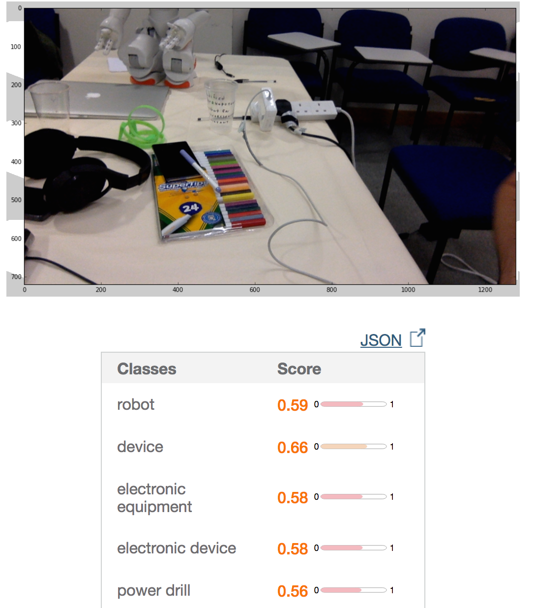
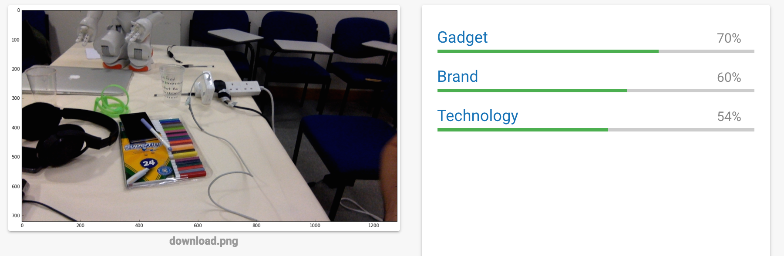
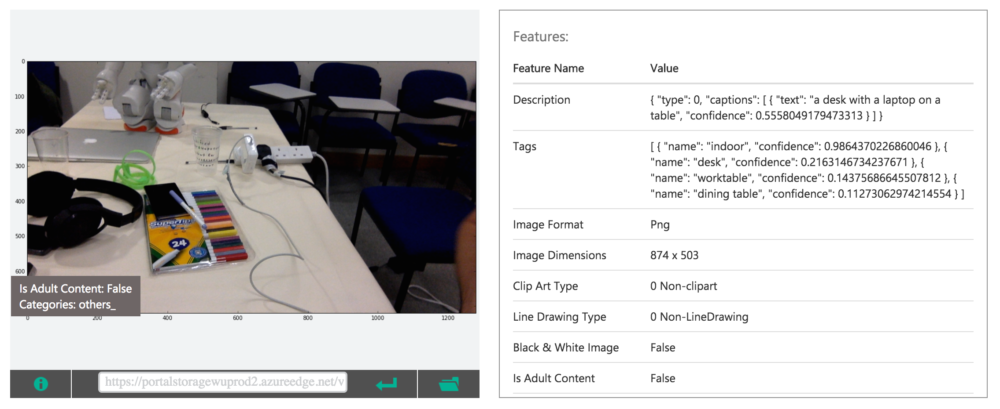
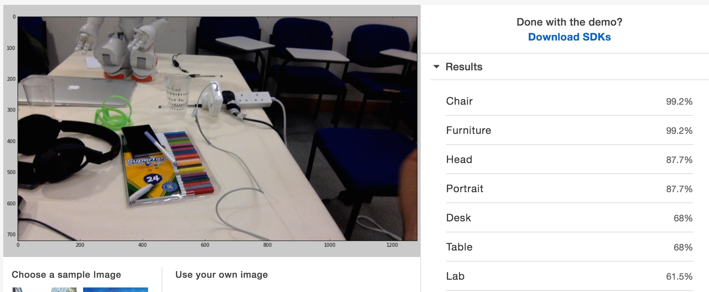

# Testing Computer Vision APIs

Here I saved a test using four different APIs:

## [IBMWatson](https://visual-recognition-demo.mybluemix.net/)

## [Google Cloud](https://cloud.google.com/vision/)

## [Microsoft Cognitive Services](https://www.microsoft.com/cognitive-services/en-us/computer-vision-api)

## [Amazon AWS](https://aws.amazon.com/rekognition/)

